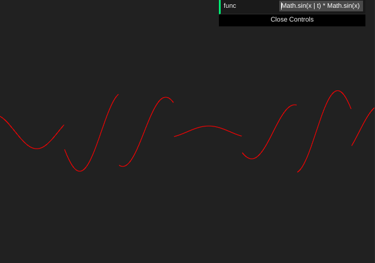

# The Chart

Check it out: http://js-coder.tk/computer-graphics/chart/

## Features

- Drag & drop
- Zoom (by mouse)
  - also you can change zoom by specific axis (when shift key is pressed)
- Change expression
- You can use time variable in the expression (t)

## Lang & techs

- TypeScript, Pug, Scss
- Canvas 2d
- Parsel
