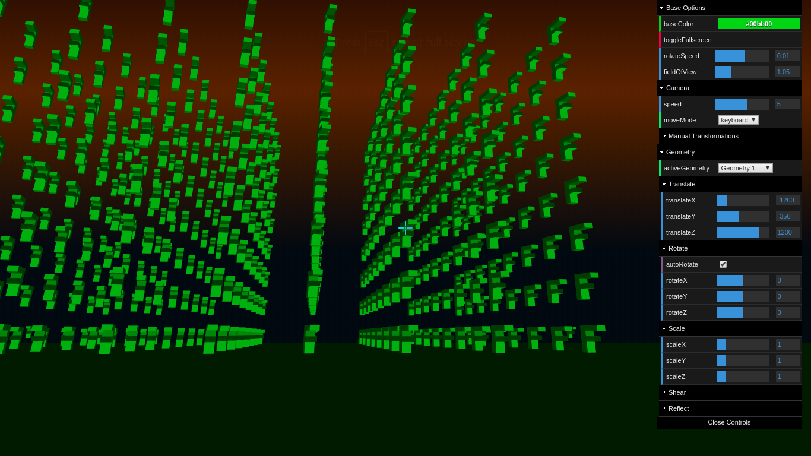

# 3D Graphics

Check it out: https://js-coder.tk/computer-graphics/3d/

YouTube: https://youtu.be/w21uZKaBTic



In this demo 'the 3d' was drawn. The demo world is game-like world. You can click on the scene to
show 'game' cursor insted of real cursor. To rotate the camera you can use your mouse, for move the camera - your keyboard.

There's list of keys to use in the demo:

- W/S/A/D - forward, back, left, right
- Space - up
- Shift - down

p.s. on mobile there's only two way to move the camera - 'auto mode' or
'manual transformations in 'camera' folder of controls

Some 'F's and cubes live on the scene. You can manipulate them by controls panel on the right.
You need select the Geometry first (see videos for example).

There's a lot of controls of demo, camera and geometries. You can see how use them in the videos (some of last ones).

All transformations are provided by affine transformations (it's the demo heart).

## Features

- Fullscreen supports
- Pointer lock (line in games)
- Full controll of the scene. There's really a lot of controls. You can change color, geometries rotating speed, camera speed, camera moving mode, change field of view, set transformations for camera (translate, rotate by each axis), toggle depth test, select a geometry and move, rotate, scale, shear, and reflect it (all of this by each of axis too), toggle auto rotating of the geometry.
- Good performance

## Lang & techs

- TypeScript, Pug, Scss
- WebGL (vanilla WebGL, no other libraries for drawing)
- GLSL language
- Pointer Lock API
- Fullscreen API

## Build

```console
npm i
npm start
npm run build
```

p.s. use yarn if you want to contribute to this repo

## Screenshots, video and subdemos

In fact, this demo is result of my learning of the WebGL. Of 'sub demos' you can find in [learnWebGl folder](../learnWebGl).

There's some of Screenshots and videos I made while I'm was learning the WebGL.

- Screenshots: [learnWebGl/screenshots](../learnWebGl/screenshots)
- Videos: [learnWebGl/videos](../learnWebGl/videos)
- Subdemos
  - [js-coder.tk/computer-graphics/gl/4](https://js-coder.tk/computer-graphics/gl/4)
  - [js-coder.tk/computer-graphics/gl/3](https://js-coder.tk/computer-graphics/gl/3)
  - [js-coder.tk/computer-graphics/gl/2](https://js-coder.tk/computer-graphics/gl/2)
  - [js-coder.tk/computer-graphics/gl/1](https://js-coder.tk/computer-graphics/gl/1)
  - [js-coder.tk/computer-graphics/gl/0](https://js-coder.tk/computer-graphics/gl/0)
  - [js-coder.tk/computer-graphics/gl/5](https://js-coder.tk/computer-graphics/gl/5)
