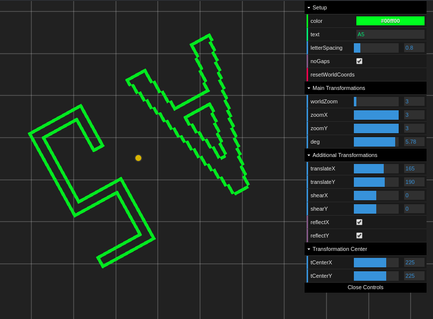

# Computer Graphics

## Affine transformations

- Source: [affine](./affine)
- Link: https://js-coder.tk/computer-graphics/affine/
- YouTube: https://youtu.be/w21uZKaBTic

## Bresenham's line Algorithm

- Source: [bresenham](./bresenham)
- Link: https://js-coder.tk/computer-graphics/bresenham/

## The Chart

- Source: [chart](./chart)
- Links: https://js-coder.tk/computer-graphics/chart/

