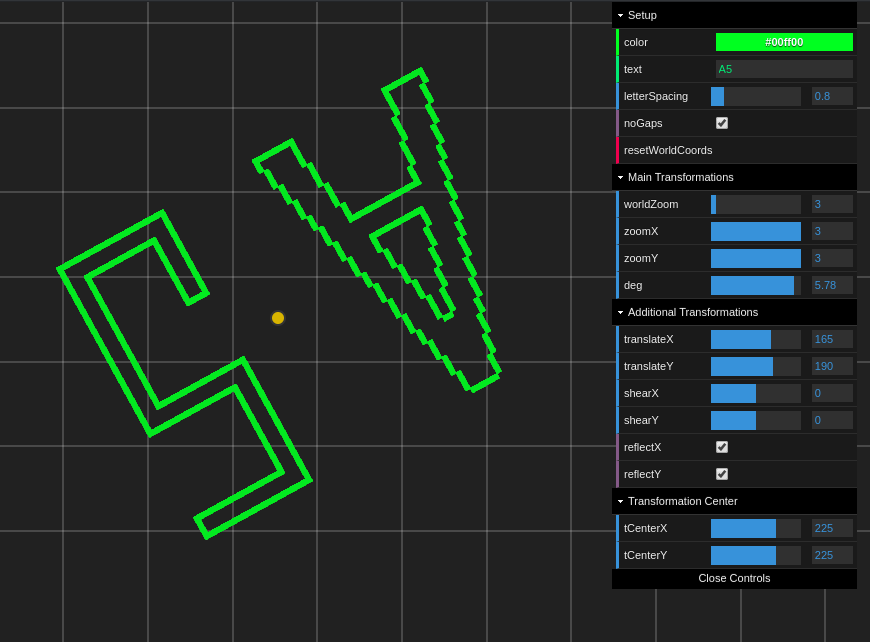

# Affine transformations

Check it out: http://js-coder.tk/computer-graphics/affine/
YouTube: https://youtu.be/w21uZKaBTic



In this demo you can write your own text and we draw it by the Bresenham's line algorithm (unfortunately only 3 characters in our font now, but you can send a pull request, just edit the [font](./src/font.json)).

And then you can use some affine transformations like translate, rotate, scale, shear and reflect.
You can move and zoom the 'world' too.

All transformations (excluded worlds zoom and translate) provide by matrixes ([affine.ts](./src/affine.ts))

## Features

- Available transformations: zoom, scale, shear, translate and reflet
- noGaps options provide better quality for transformations (no gaps between pixels after transformations)
- Select transformations center
- World Zoom and Drag & drop
- Available Symbols: A, D, 5
- Default symbol for unknown
- Change letter spacing
- Change color of chars
- Touch screen supports
- Accessibility (particle)
- Multi level grid on world zoom

## Lang & techs

- TypeScript, Pug, Scss
- Canvas 2d
- Parsel

## Font

In this demo font is just array of lines

```js
[
  [x1, y1, x2, y2],
  . . .
]
```

## Build

```console
npm i
npm start
npm run build
```

p.s. use yarn if you want to contribute to this repo
