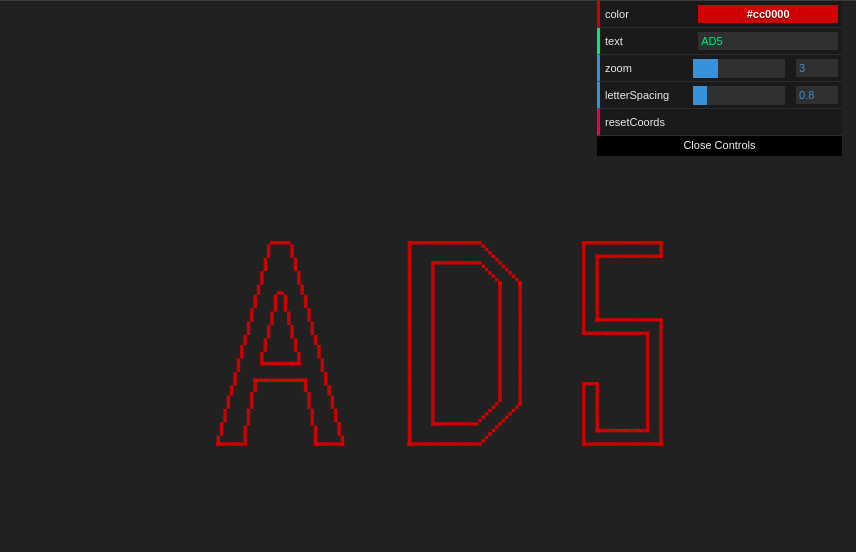

# Bresenham's line Algorithm

Check it out: https://js-coder.tk/computer-graphics/bresenham/



In this Bresenham's line Algorithm demo you can write your own text and we draw it by the algorithm (unfortunately only 3 characters in our font now, but you can send a pull request, just edit the [font](./src/font.json))

## Features

- Zoom
- Available Symbols: A, D, 5
- Default symbol for unknown
- Change letter spacing
- Change color of chars
- Drag & drop
- Mobile supports

## Lang & techs

- TypeScript, Pug, Scss
- Canvas 2d
- Parsel

## Font

In this demo font is just array of lines

```js
[
  [x1, y1, x2, y2],
  . . .
]
```

## Build

```console
yarn
yarn start
yarn build
```

or

```console
npm i
npm start
npm run build
```
