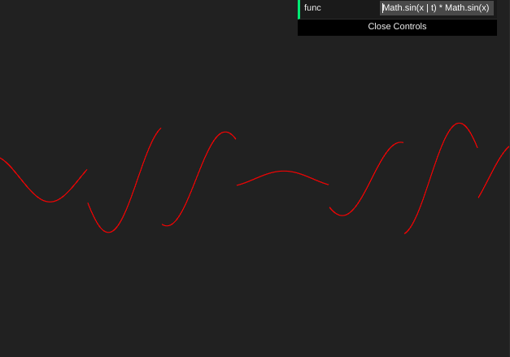

# The Chart

Check it out: https://js-coder.tk/computer-graphics/chart/



## Features

- Drag & drop
- Zoom (by mouse)
  - also you can change zoom by specific axis (when shift key is pressed)
- Change expression
- You can use time variable in the expression (t)
- Responsive (only the pinch zoom doesn't support on mobile)
- Discontinuous Functions support (particle)

## Limitation

- The Chart use a really simple parser for func field, so you can write any valid Javascript in that field (p.s. yep, hi xss, there is only one resone for that: I don't want to use somthing like math.js, because it's big and slow with parsel)

## Lang & techs

- TypeScript, Pug, Scss
- Canvas 2d
- Parsel

## Build

```console
yarn
yarn start
yarn build
```

or

```console
npm i
npm start
npm run build
```
